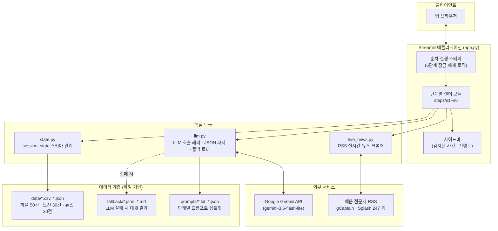

# BEAR·ING

**글로벌 물류 리스크가 감지된 순간부터 검증·합의·실행·고객통보·사후분석까지, 하나의 사건을 끝까지 따라가는 AI 위기대응 관제실.**

현대글로비스의 완성차 해상운송 업무를 배경으로, 로테르담 항만파업 같은 물류 위기가 터졌을 때 사람이 반나절 걸려 처리하던 의사결정 과정을 AI가 6단계 파이프라인으로 자동화해서 보여주는 데모 애플리케이션입니다.

> **BEAR·ING** — 항해 용어 "bearing"(방위, 방향 감각)이자, "bear"(짐을 지다·견디다) + "-ing"(계속 진행 중)의 중의어. 위기 속에서도 화물을 나르고 판단 기준을 잃지 않는다는 뜻.

---

## 목차

1. [프로젝트 개요](#프로젝트-개요)
2. [서비스 구성도](#서비스-구성도)
3. [주요 기능](#주요-기능)
4. [모델 및 프롬프트](#모델-및-프롬프트)
5. [기대효과 및 개선점](#기대효과-및-개선점)
6. [실행 방법](#실행-방법)

---

## 프로젝트 개요

물류 위기 대응은 보통 이런 순서로 흘러갑니다 — *"뉴스에서 이상 징후를 본다 → 어떤 화물이 영향받는지 파악한다 → 대안을 검토한다 → 여러 부서가 합의한다 → 실행 문서를 만든다 → 고객에게 알린다 → 나중에 왜 이런 일이 반복되는지 분석한다."* 이 전체 흐름을 사람이 각 단계마다 이메일과 회의로 처리하면 반나절에서 하루가 걸립니다.

BEAR·ING은 이 흐름을 **감지 → 검증 → 합의 → 플레이북 → 고객통보 → 사후분석**의 6단계 파이프라인으로 구조화하고, 각 단계에 LLM(Gemini)을 붙여 자동화했습니다. 각 단계는 이전 단계가 완료돼야 다음 단계가 열리는 **순차 진행 구조**이며, API 키가 없거나 LLM 호출이 실패해도 미리 준비된 결과로 전체 흐름이 끊기지 않고 계속 동작하도록 설계되어 있습니다.

---

## 서비스 구성도



### 기술 스택

| 계층 | 기술 | 비고 |
|---|---|---|
| **Frontend / Backend** | [Streamlit](https://streamlit.io) `>=1.57` | 프론트-백엔드가 분리되지 않은 Python 단일 애플리케이션. 서버 사이드 렌더링 + `session_state`로 상태 관리 |
| **AI Model** | Google **Gemini** (`google-genai` SDK), 기본 모델 `gemini-3.5-flash-lite` | 무료 티어(RPM 15 / RPD 500)로 6단계 전부를 운용 가능한 경량 모델 |
| **DB** | 없음 — **파일 기반 상태 관리** | `data/*.csv`·`*.json`(입력 더미데이터), `fallback/*`(결과 캐시), `st.session_state`(런타임 상태, 서버 재시작 시 휘발) |
| **데이터 처리** | pandas | 화물/노선 CSV 로딩, 데이터프레임 표시 |
| **외부 데이터 수집** | feedparser (RSS) | 해운 전문지 4곳(gCaptain, Splash 247, The Loadstar, FreightWaves) 실시간 크롤링, 6초 타임아웃 |
| **스타일** | 커스텀 CSS (`.streamlit/config.toml` + `st.html`) | Hyundai 브랜드 컬러 팔레트, SUIT Variable 폰트(눈누, 무료) |

**왜 DB가 없는가**: 데모/시연 목적의 단일 세션 애플리케이션이라, 세션 간 영속성이 필요 없는 값들(사건 목록, 단계별 결과)은 Streamlit의 `session_state`로 충분합니다. 대신 "정적 입력 데이터"(화물/노선/뉴스)와 "LLM 실패 시 대체 결과"는 각각 CSV/JSON 파일로 관리해 별도 DB 없이도 전체 파이프라인이 항상 동작하도록 했습니다.

---

## 주요 기능

앱 내부적으로는 ①~⑥ 번호로 관리되지만, 화면에는 아래 순서(=실제 파이프라인 순서)로 노출됩니다.

| 순서 | 기능 | 역할 | 사용자 가치 |
|---|---|---|---|
| 1 | **감지 · 리스크 레이더** | 해운 뉴스(실시간 RSS 또는 캐시)를 스캔해 물류 리스크 이벤트를 추출하고, 진행 중인 화물 50건과 대조해 영향받는 화물과 A/B/C 대체 운송안을 설계 | 수십 건의 뉴스를 사람이 일일이 읽고 "이게 우리 화물에 영향 있나?"를 판단하는 작업을 자동화. 놓치기 쉬운 간접영향(환적항 경유)까지 잡아냄 |
| 2 | **검증 · 반대심문** | "반대심문관" 페르소나가 선택된 대체안에 대해 3라운드에 걸쳐 근거를 캐묻고, 최종 PASS/CONDITIONAL/REJECT 판정을 내림 | 담당자 한 명의 판단에만 의존하지 않고, 결정이 무너질 수 있는 지점(위험물 규정, 선복 확약 여부 등)을 체계적으로 검증. 답변 내용에 따라 다음 질문이 실시간으로 달라짐 |
| 3 | **합의 · 원탁회의** | 해상운영·항공물류·원가관리·고객대응 4개 팀 페르소나가 순차로 발언하고, 조정자가 최종 합의안을 도출 | 부서 간 이해관계가 다른 의사결정(속도 vs 비용 vs 리스크)을 한 화면에서 시뮬레이션. 소수의견까지 기록해 의사결정 과정을 투명하게 남김 |
| 4 | **플레이북** | 사건 지속기간·물동량 변화율·허용 추가비용 파라미터를 조정해 실행 가능한 대응 플레이북을 마크다운 문서로 생성·다운로드 | 회의에서 결정한 내용을 현장 담당자가 따라할 수 있는 체크리스트(초기대응/후속조치/에스컬레이션 기준)로 문서화. 시나리오를 바꿔가며 what-if 재생성 가능 |
| 5 | **고객통보** | 반대심문 판정과 합의안을 반영해 톤이 다른 고객 메일 3종(사실중심/관계중심/보상제시)과 예상 반응을 생성 | 위기 상황에서 가장 시간이 촉박한 대고객 커뮤니케이션 초안을 즉시 확보. 화주와의 관계 특성에 따라 톤을 골라 쓸 수 있음 |
| 6 | **사후분석** | 누적된 과거 사건 로그(13건)를 원인 유형별로 분류해 반복 패턴과 개선 제안을 도출 | "이번에만 잘 넘기면 끝"이 아니라, 같은 유형의 위기가 왜 반복되는지(예: 대응 착수 시점이 항상 출항 이후) 데이터로 짚어 재발 방지책을 제안 |

**공통 설계 원칙**
- 각 단계는 **순서대로만 진행**됩니다(이전 단계 완료 전에는 다음 단계 버튼이 잠김) — 실무에서 검증 없이 실행하거나, 합의 없이 고객에게 통보하는 일이 없도록 프로세스 자체를 강제합니다.
- API 키가 없거나 LLM 호출이 실패해도 **`fallback/`의 사전 준비된 결과로 전체 흐름이 끊기지 않습니다.**

---

## 모델 및 프롬프트

### 모델 선택 이유

| 항목 | 내용 |
|---|---|
| 사용 모델 | Google **Gemini** `gemini-3.5-flash-lite` |
| 선택 이유 | (1) **무료 티어로 전체 데모 운용 가능** — RPM 15 / RPD 500로 6단계 파이프라인을 여러 번 반복 시연해도 한도에 여유가 있음. (2) 한국어 생성 품질과 JSON 구조화 출력 안정성이 라이트 모델 중 우수. (3) `-latest` 별칭 대신 모델명을 명시 고정해, 임의 모델로 자동 전환되며 무료 한도가 줄어드는 것을 방지 |
| 호출 방식 | `google-genai` SDK, 텍스트 생성은 스트리밍(`generate_content_stream`)과 일반 호출(`generate_content`) 둘 다 사용. JSON 응답이 필요한 단계는 `thinking_budget`을 최소화해 출력 토큰을 아낌 |

### 프롬프트 설계 원칙

1. **역할·원칙·형식을 명확히 분리**한다 — "당신은 무엇이다 / 원칙은 이렇다 / 출력 형식은 이렇다"를 프롬프트 상단에 순서대로 명시
2. **JSON 스키마를 프롬프트에 직접 예시로 제공**한다 — 필드명과 타입까지 프롬프트 안에 리터럴로 박아 넣어 파싱 실패율을 낮춤
3. **어투·형식 규칙을 명시적으로 강제**한다 — "~합니다체로 끝내라", "실제 개행 문자를 써라" 등, 모델이 관성적으로 틀리기 쉬운 부분을 규칙으로 못박음
4. **모든 JSON 호출은 실패를 가정하고 설계**한다 — `llm.call_json()`이 코드펜스 제거 → 파싱 → 1회 재시도 → 폴백 순으로 동작해, 프롬프트가 아무리 잘 짜여 있어도 실패 시 앱이 죽지 않게 함
5. **입력값은 최소한으로 스코프를 좁혀서 전달**한다 — 예: 화물 매칭 단계는 심각도 4 이상인 이벤트만 골라 전달해, 경미한 뉴스가 무관한 화물을 끌어들이는 것을 방지

### AI 역할 · 입력값 · 출력값 예시

#### ① 감지 — 리스크 이벤트 추출 (`prompts/s3_extract.txt`)

- **AI 역할**: 글로벌 물류 리스크 애널리스트. 뉴스 더미에서 물류에 실질적 영향을 주는 이벤트만 골라 구조화
- **입력값**: 뉴스 기사 텍스트 묶음 (id/날짜/출처/제목/본문)
- **출력값 예시**:
  ```json
  {
    "type": "PORT_STRIKE",
    "location": {"port_code": "NLRTM", "name": "로테르담", "region": "북유럽"},
    "period": {"start": "2026-08-14", "end": "2026-08-22"},
    "severity": 4,
    "confidence": 0.9,
    "impact": {"delay_days_min": 7, "delay_days_max": 14, "affects_modes": ["SEA"]},
    "summary": "로테르담 컨테이너 터미널 노조가 8일간 파업에 돌입하며 처리능력이 정상의 25% 수준으로 떨어진다.",
    "source_ids": ["N001", "N002", "N003"]
  }
  ```

#### ① 감지 — 화물 매칭 및 대체안 설계 (`prompts/s3_match.txt`)

- **AI 역할**: 글로비스 운영 컨트롤타워. 리스크 이벤트와 화물 50건을 대조해 영향 여부·대체안 판단
- **입력값**: 심각도 4 이상 이벤트 JSON + 화물 CSV + 노선 CSV
- **출력값 예시** (화물 1건):
  ```json
  {
    "bl_no": "GLVS2608-0417",
    "impact": "DIRECT",
    "reason": "POD가 NLRTM이고 ETA 2026-08-18이 파업기간 한복판에 들어간다.",
    "delay_est_days": 12,
    "sla_breach": true,
    "options": [
      {"label": "A", "route": "인천→암스테르담 항공 직항", "mode": "AIR", "lead_time_days": 2, "risk": "HIGH", "tradeoff": "운임 7.8배, UN3480 리튬이온 배터리 항공운송 규제 대응 필요"},
      {"label": "C", "route": "부산→함부르크 양륙 후 육상 인도", "mode": "MULTIMODAL", "lead_time_days": 21, "risk": "MID", "tradeoff": "항공의 1/3 비용, 지연 3일로 억제"}
    ],
    "recommend": "C",
    "why": "A안은 위험물 항공 신고에 최소 3영업일이 필요해 실행 리스크가 크다. C안은 비용 70% 절감하며 지연을 3일로 억제한다."
  }
  ```

#### ② 검증 — 반대심문 (`prompts/s1_devil.txt`, `prompts/s1_verdict.txt`)

- **AI 역할**: 반대심문관. 결정을 승인하는 게 아니라 무너질 지점을 찾아 질문하고, 3라운드 후 판정
- **입력값**: 화물 정보 + 선택된 대체안 + 라운드 번호(질문 생성) / 화물+대체안+전체 심문 대화록(판정)
- **입력 예시(담당자 답변)**: `"위험물 신고는 3영업일 전에 완료했고 SOC 30% 규정도 준수했습니다."`
- **출력값 예시(다음 질문, 답변에 따라 축이 바뀜)**: `"인코텀즈 DDP 조건 하에서... 지체료 및 지연 보상금의 한도를 계약서상 어디까지 명시해 두셨습니까?"`
- **최종 판정 출력값 예시**:
  ```json
  {
    "verdict": "CONDITIONAL",
    "score": {"근거충실도": 3, "리스크대비": 2, "실행가능성": 3},
    "unresolved": [
      {"issue": "UN3480 위험물 신고(DGD) 및 SOC 30% 증빙 미확인", "severity": "HIGH", "owner": "위험물 운송관리팀", "due": "2026-08-14 12:00"}
    ],
    "conditions": ["항공 선복은 항공사 서면 확약 확보 후에만 확정 처리할 것"],
    "one_line": "항공 전환의 납기 논리는 타당하나 위험물 요건과 선복 확약이 미검증 상태이므로 조건부 승인한다."
  }
  ```

#### ③ 합의 — 원탁회의 (`prompts/s2_agents.json`, `prompts/s2_moderator.txt`)

- **AI 역할**: 4개 팀 페르소나(각기 다른 목표·말버릇을 가진 시스템 프롬프트) + 조정자
- **입력값**: 화물+대체안+반대심문판정 컨텍스트 + 앞선 팀들의 발언(팀마다 누적)
- **출력값 예시**: 각 팀 3~4문장 발언 → 조정자가 `{"decision": "C", "title": "...", "rationale": "...", "conditions": [...], "dissent": "...", "next_actions": [...]}` 형태로 합의안 종합

### 실패 시 동작 방식 (`llm.py`)

```
call_json(): 호출 → 코드펜스 제거 → JSON 파싱 → (실패 시) 1회 재시도 → (그래도 실패 시) fallback/*.json 반환
```

모든 공개 함수는 예외를 밖으로 던지지 않도록 설계되어, API 키가 없거나 네트워크가 끊겨도 6개 탭 전부가 캐시된 결과로 렌더됩니다.

---

## 기대효과 및 개선점

### 정량적 효과 (데모 시나리오 기준)

- 뉴스 20건 → 물류 영향 이벤트 추출까지: 수 초
- 감지 → 검증 → 합의 → 플레이북 → 고객통보 → 사후분석 전체 파이프라인: **약 5분 내외**로 시연 가능 (동일 업무를 수작업으로 처리할 경우 반나절 이상 소요된다고 가정)
- 화물 50건 중 실제 영향 화물을 자동 식별해, 담당자가 전수 검토해야 할 대상을 좁힘 (예: 50건 → 7건)

### 정성적 효과

- **의사결정 과정의 표준화**: 매번 다른 방식으로 대응하던 위기 상황을 "감지→검증→합의→실행→통보→학습"이라는 동일한 프레임으로 처리
- **의사결정 근거의 문서화**: 반대심문의 미해결 항목, 합의안의 소수의견까지 기록에 남아 사후 감사·재발방지 근거로 활용 가능
- **판단 편향 완화**: 담당자 1인의 직관이 아니라, 반대심문(비판적 검토)과 4개 팀 관점(다면적 검토)을 거치도록 프로세스 자체가 강제됨

### 적용 가능 분야

- 해상운송 외 항공·육상 물류 전반의 위기대응 워크플로우
- 물류 외 도메인의 "감지→검증→합의→실행→통보→학습" 구조가 적용 가능한 다른 위기관리 업무(예: IT 장애 대응, 공급망 리스크 관리, 품질 이슈 대응)
- 사내 프로세스 교육/온보딩용 시뮬레이터 (신입 담당자가 실제 사건 없이 의사결정 과정을 연습)

### 한계점

- **실시간 뉴스와 더미 화물 데이터의 불일치**: 라이브 RSS로 감지되는 실제 사건은 데모용으로 설계된 화물 50건(로테르담 파업 시나리오 기준)과 지리적으로 안 겹치는 경우가 많아, 실제 매칭 결과가 0건으로 나오는 경우가 있음 (현재는 이 경우 데모 시나리오 화물로 대체 표시)
- **세션 간 영속성 없음**: DB가 없어 브라우저를 새로고침하거나 서버가 재시작되면 진행 상황이 모두 초기화됨
- **화물 매칭이 사건 단위로 완전히 분리되어 있지 않음**: 심각도 HIGH인 사건이 여러 개 감지되면, 영향 화물 수가 사건별로 정밀하게 분리되지 않고 동일하게 표시되는 경우가 있음
- **경량 모델의 한계**: 무료 티어 경량 모델 특성상 복잡한 산술 계산(합계 등)은 신뢰하지 않고 가능한 경우 코드에서 결정론적으로 재계산하는 방식으로 보완하고 있음
- **단일 사용자/단일 세션 가정**: 여러 담당자가 동시에 같은 사건을 다른 관점에서 다루는 협업 시나리오는 지원하지 않음

### 향후 개선 계획 / 추가 개발 방향

- 화물 매칭을 사건(incident) 단위로 완전히 스코프 분리해, 사건별로 독립적인 영향 화물·대체안을 관리
- `session_state` 대신 실제 DB(예: SQLite/PostgreSQL)를 도입해 세션 간 이력 관리 및 다중 사용자 지원
- 플레이북 단계에서 생성된 문서를 사내 협업툴(Slack, Notion 등)로 바로 발행하는 연동 기능
- 반대심문 라운드 수, 합의 참여 팀 구성 등 파이프라인 자체를 설정 가능하게 만들어 다른 도메인(항공/육상 물류, IT 장애 대응 등)에 재사용
- 사후분석 단계에서 실제 사건 이력이 누적될수록 패턴 탐지 정확도가 개선되는 학습 루프 설계

---

## 실행 방법

```bash
pip install -r requirements.txt
cp .env.example .env   # GEMINI_API_KEY 입력 (없어도 실행됨, https://aistudio.google.com 무료 발급)
streamlit run app.py
```

| 환경변수 | 기본값 | 설명 |
|---|---|---|
| `GEMINI_API_KEY` (또는 `GOOGLE_API_KEY`) | 없음 | 없으면 `fallback/`의 캐시된 결과로 동작 |
| `MODEL_NAME` | `gemini-3.5-flash-lite` | 사용할 Gemini 모델 |

**API 키가 없어도 6단계 전부 캐시된 결과로 렌더됩니다.** 키를 넣으면 각 단계의 실행 버튼이 실제 LLM 호출로 결과를 생성합니다.

### 파일 구조

```
app.py              Streamlit 진입점 — 레이아웃, 사이드바, 단계 진행 스테퍼
llm.py               LLM 호출 래퍼 + JSON 파서 + 폴백 로더
state.py             session_state 스키마, 누적 사건 로그, 데이터 로더
live_news.py          RSS 실시간 뉴스 크롤러
steps/                6개 단계별 렌더 모듈 (s1_devil ~ s6_comms)
prompts/               LLM 프롬프트 전량 (.txt/.json)
fallback/               API 키 없이도 렌더되는 캐시된 결과
data/                   더미 데이터 (화물 50건 · 노선 30건 · 뉴스 20건)
assets/                 로고 이미지
.streamlit/config.toml   테마(색상) 설정
```

더 자세한 내부 구조와 세션 스키마는 [PROJECT_SUMMARY.md](PROJECT_SUMMARY.md)를 참고하세요.
