# BEAR·ING 서비스 흐름

사용자가 앱에 들어와서 사건 하나를 끝까지 처리하는 전체 흐름입니다. 6단계는 **순서대로만 진행**되며, 이전 단계를 완료해야 다음 단계 버튼이 열립니다(완료한 단계로는 언제든 되돌아가 다시 볼 수 있습니다).

## 전체 흐름도

```mermaid
flowchart TD
    Start(["앱 진입"]) --> Empty["사이드바: 감지된 사건 0건<br/>본문: 1단계만 활성, 2~6단계 잠김"]
    Empty --> Scan{"뉴스 스캔 실행"}
    Scan -->|캐시 뉴스 20건 또는<br/>실시간 RSS 선택| Extract["이벤트 추출 + 화물 50건 대조"]
    Extract --> Detected["사이드바에 실제 감지된 사건 채워짐<br/>이벤트 카드 + 영향 화물 + A/B/C 대체안 표시"]
    Detected --> Pick["대체안 중 하나 '심의 요청' 클릭"]
    Pick --> Next1["다음 단계로 → 검증"]

    Next1 --> Interrogate["반대심문관이 라운드마다<br/>예/아니오 · A/B 닫힌 질문"]
    Interrogate --> Answer{"빠른 답변 버튼<br/>또는 직접 입력"}
    Answer -->|3라운드 반복| Interrogate
    Answer -->|3라운드 종료 또는 건너뛰기| Verdict["PASS / CONDITIONAL / REJECT 판정"]
    Verdict --> Next2["다음 단계로 → 합의"]

    Next2 --> Council["'원탁회의 소집' 클릭"]
    Council --> Statements["4개 팀이 순차로 의견 스트리밍<br/>(해상운영·항공물류·원가관리·고객대응)"]
    Statements --> Consensus["조정자가 합의안 도출<br/>(결정안 · 실행조건 · 소수의견 · 후속액션)"]
    Consensus --> Next3["다음 단계로 → 플레이북"]

    Next3 --> Params["지속기간 · 물동량 · 추가비용<br/>슬라이더 조정 후 '플레이북 생성'"]
    Params --> Doc["실행 플레이북 문서 생성 + .md 다운로드"]
    Doc --> Next4["다음 단계로 → 고객통보"]

    Next4 --> Mail["'메일 3종 생성' 클릭"]
    Mail --> Drafts["사실중심 · 관계중심 · 보상제시<br/>3개 탭 + 예상 고객 반응"]
    Drafts --> Next5["다음 단계로 → 사후분석"]

    Next5 --> RCA["'패턴 분석 실행' 클릭"]
    RCA --> Pattern["누적 사건 13건 원인 분류<br/>+ 반복 패턴 · 개선 제안"]
    Pattern --> Done(["진행도 6/6 완료"])
```

## 단계별 상세 흐름

### 0. 진입 화면

- 사이드바 "감지된 사건 · 0건" — 아직 아무것도 감지되지 않은 상태로 시작합니다.
- 본문은 6단계가 번호 붙은 버튼(`1. 감지 · 리스크 레이더` ~ `6. 사후분석`)으로 나열되고, **1단계만 클릭 가능**하고 나머지는 잠겨 있습니다.
- 사이드바 "진행도"에는 6단계 각각이 "대기" 상태로 표시됩니다.

### 1단계 — 감지 · 리스크 레이더

1. "실시간 RSS 뉴스" 토글로 **캐시 뉴스 20건**(기본값) 또는 **실시간 RSS**(gCaptain·Splash 247 등) 중 선택
2. "뉴스 스캔 실행" 클릭 → 진행 상태가 실시간으로 표시됨(뉴스 로드 → 이벤트 추출 → 화물 대조)
3. 결과가 나오면:
   - **사이드바**에 실제로 감지된 사건들이 카드로 채워짐(심각도 배지, 기간, 영향 건수)
   - **본문**에 추출된 리스크 이벤트 카드 + 영향받는 화물 통계 + 화물 상세(A/B/C 대체안 비교) 표시
4. 사이드바에서 사건을 바꿔 선택하면 본문의 이벤트/화물 내용도 그 사건에 맞춰 필터링됨
5. 화물 상세에서 원하는 대체안의 "이 안으로 심의 요청" 클릭 → 그 화물·대체안이 다음 단계로 넘어감
6. "다음 단계로 — 검증 · 반대심문" 버튼 클릭 → 화면 맨 위로 스크롤되며 2단계로 이동

### 2단계 — 검증 · 반대심문

1. 선택한 화물·대체안 요약 카드 확인
2. "심문 시작" 클릭 → 반대심문관이 **예/아니오 또는 A/B로 답할 수 있는 닫힌 질문**을 던짐
3. 질문 아래 "빠른 답변" 버튼(예 / 아니오 / A / B)을 클릭하거나 직접 입력창에 답변
4. 답변 내용에 따라 **다음 라운드 질문이 실시간으로 다르게 생성**됨 (최대 3라운드)
5. 3라운드가 끝나거나 "심문 건너뛰고 판정 보기"를 누르면 PASS / CONDITIONAL / REJECT 판정문(근거 점수, 소명 항목, 미해결 항목, 승인 조건)이 표시됨
6. "다음 단계로 — 합의 · 원탁회의" 클릭

### 3단계 — 합의 · 원탁회의

1. 해상운영·항공물류·원가관리·고객대응 4개 팀 로스터(이름+목표)가 항상 보임
2. "원탁회의 소집" 클릭 전에는 **실제 의견은 보이지 않음**
3. 클릭하면 4개 팀이 앞선 팀 발언을 참고하며 순차로 3~4문장씩 의견을 스트리밍으로 발언
4. 마지막에 조정자가 최종 합의안(결정안, 실행 전제조건, 소수의견, 후속 액션)을 정리
5. "다음 단계로 — 플레이북" 클릭

### 4단계 — 플레이북

1. 사건 지속기간 / 물동량 변화율 / 허용 추가비용 슬라이더 3개 조정
2. "플레이북 생성" 클릭 → 초기대응(D+0~24시간)부터 에스컬레이션 기준까지 담긴 실행 문서 생성
3. 화면에서 바로 미리보기 가능, ".md 다운로드" 버튼으로 파일 저장
4. "다음 단계로 — 고객통보" 클릭

### 5단계 — 고객통보

1. "메일 3종 생성" 클릭 → 반대심문 판정 + 합의안을 반영한 메일 3종 생성
2. **사실중심 / 관계중심 / 보상제시** 탭으로 전환하며 각 메일 제목·본문·예상 고객 반응 확인
3. "다음 단계로 — 사후분석" 클릭

### 6단계 — 사후분석

1. "패턴 분석 실행" 클릭 → 누적 사건 13건(과거 12건 + 이번 사건)을 원인 유형별로 분류
2. 원인별 건수 차트, 반복 패턴 3가지, 개선 제안 3가지, 경영진 보고용 한 줄 인사이트 표시
3. 사이드바 진행도가 **6/6 완료**로 표시되며 전체 흐름 종료

## 흐름 제어 규칙 (요약)

- 각 단계는 **이전 단계의 결과가 세션에 저장돼야** 다음 단계 잠금이 풀립니다.
- 완료한 단계는 상단 네비게이션에서 언제든 다시 클릭해 되돌아볼 수 있습니다(앞으로 건너뛰기만 막힘).
- API 키가 없거나 LLM 호출이 실패해도, 각 단계는 `fallback/`에 미리 준비된 결과로 대체되어 흐름이 끊기지 않습니다(단, "아직 실행하지 않은" 상태에서는 결과를 미리 보여주지 않고 실행 버튼을 눌러야만 진행됩니다).
